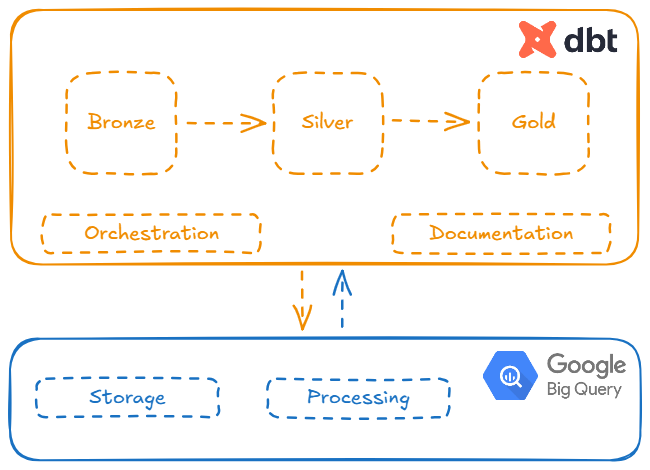

# dbt-projects

  

Esse repositório contém alguns projetos pessoais de processamento de dados utilizando como plataforma principal de processamento o DBT. O objetivo principal aqui é o aprendizado, logo os projetos tendem a ser simples e não envolver volumes excessivos de dados, mas compartilhando-os espero poder ajudar alguém que também esteja aprendendo sobre algo similar. 

## Arquitetura

A arquitetura de todos os projetos armazenados aqui segue o padrão da Arquitetura Medalhão, com suas 3 camadas principais:

- Bronze: Com dados em formato muito próximo ao encontrado na sua fonte original.
- Silver: Dados processados e preparados para consumo final.
- Gold: Camada de apresentação dos dados para os usuários, modelados de acordo com suas necessidades.

Além destas camadas principais, camadas adicionais, com modelagens extras que podem ser úteis aos dados, podem ser adicionadas aos projetos. 

## Infraestrutura

Todos os projetos são montados usando o BigQuery como plataforma de processamento e armazenamento sob a qual o DBT opera, cuidando da organização, documentação e testes dos dados resultantes, além da orquestração de todo o processamento de dados. 

  

## Projetos

Estes são os projetos atualmente armazenados neste repositório:

- [Olympedia](./projects-descriptions/olympedia.md): Contém diversos dados sobre as Olímpiadas, suas edições, resultados e atletas participantes.

